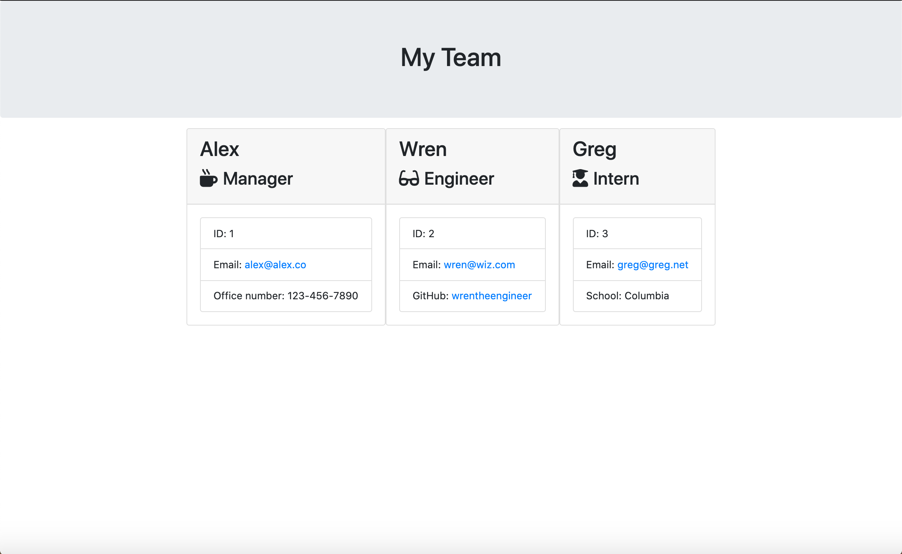
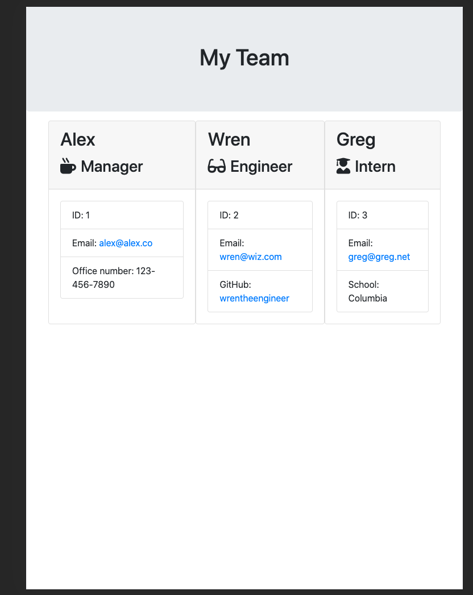

# CLI Employee Generator

## Description
A Node CLI that takes in information about employees and generates an HTML webpage that displays summaries for each person employee. The application will also provide validation checks for each employees name, id, and email inputs to assure information is in a standard format.

#### Table of Contents

[Demo](#demo) &nbsp;&nbsp;| &nbsp;&nbsp; [Installation](#installation) &nbsp;&nbsp; | &nbsp;&nbsp; [Tests](#tests) &nbsp;&nbsp; | &nbsp;&nbsp; [Useage](#useage) &nbsp;&nbsp; | &nbsp;&nbsp; [Features](#features) &nbsp;&nbsp; | &nbsp;&nbsp; [Contributing](#contributing) &nbsp;&nbsp; | &nbsp;&nbsp; [License](#license) &nbsp;&nbsp; |  &nbsp;&nbsp; [Questions](#questions)


## Demo
**View a full demo of the application here:** hhttps://drive.google.com/file/d/1F2hIIASVKm2aEedCktH0_GA-9M2PXqIy/view


**Desktop Output**



**Tablet Output**




## Installation
- To start the program, enter ```node app.js``` into the command line.
- Follow the prompts to enter information for your team members.
- When done, a team.html file will be generated in the output directory. See the Demo section above for examples of the finished product.
- 

## Tecnologies
This application was made using:
- Javascript
- Node.js
- HTML

## Tests
- To run tests, enter ```npm run test``` in the command line.

## Usage
- Use this app to create a clean, stylish org chart for your team with handy information and contact links.

